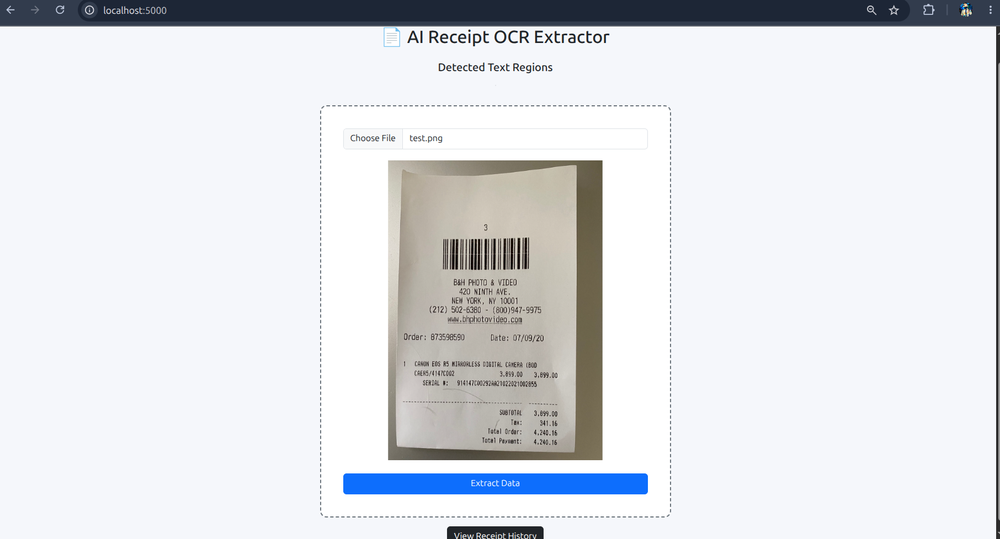
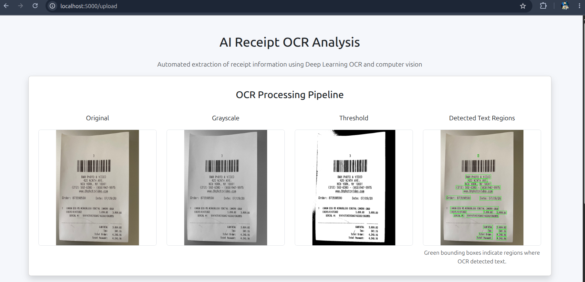
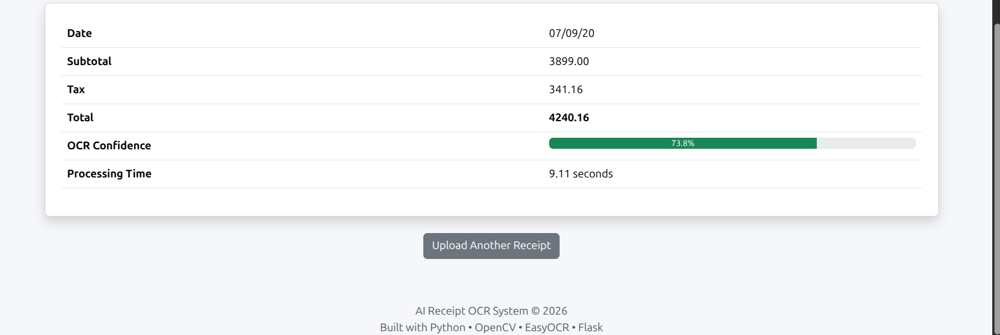
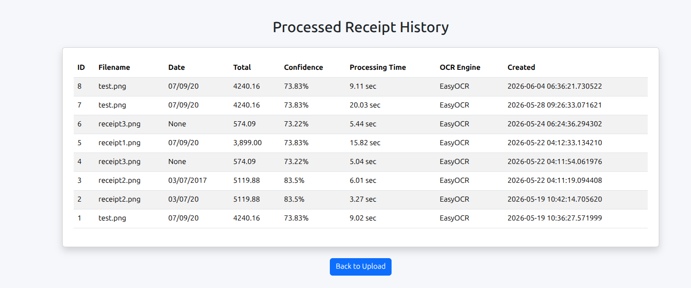
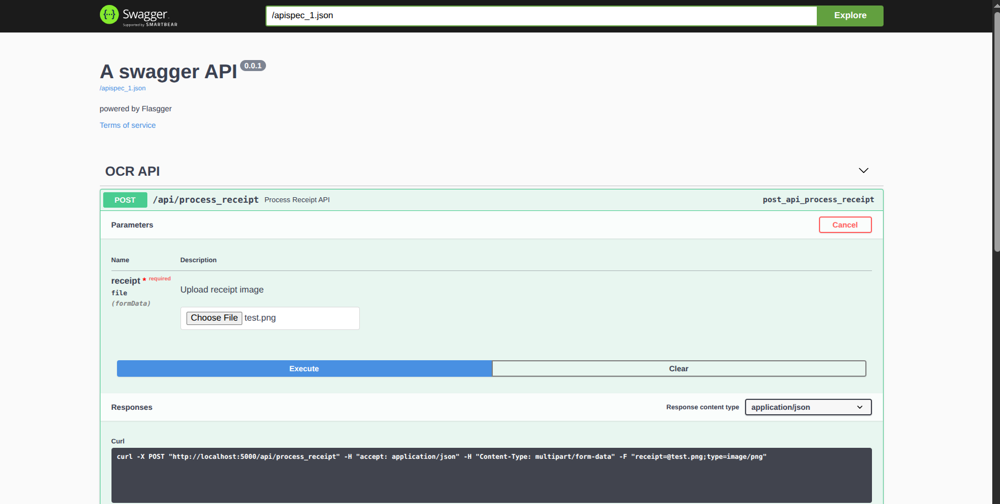
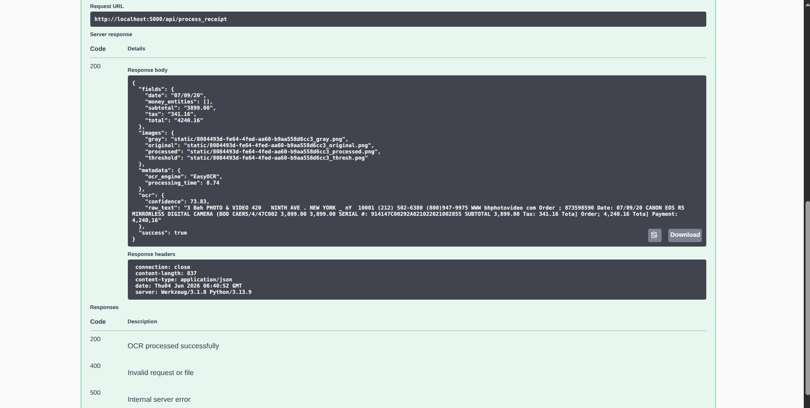
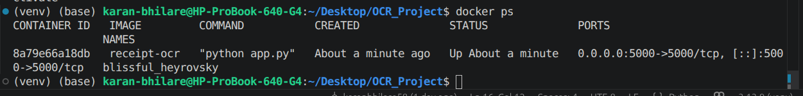
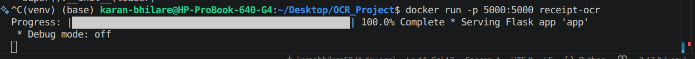
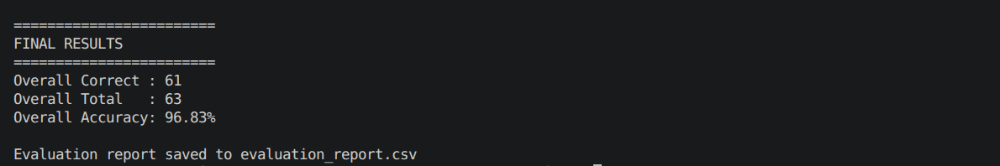

# AI Receipt OCR System

An end-to-end AI-powered Receipt OCR System that extracts structured financial information from receipt images using Computer Vision, OCR, NLP, and a Flask web application.


## Overview

The system automatically processes receipt images and extracts key financial fields such as:

* Date
* Subtotal
* Tax
* Total Amount

The application combines image preprocessing, OCR, text normalization, intelligent receipt parsing, database storage, REST APIs, and evaluation analytics into a production-style pipeline.

## OCR Engine Evolution

The project initially used Tesseract OCR and was later upgraded to EasyOCR to improve recognition quality on noisy receipt images and achieve higher extraction accuracy.

## Dataset

The evaluation dataset contains 17 receipt images across multiple business categories:

- Grocery Stores
- Restaurants
- Hotels
- Gas Stations
- Retail Stores
- Pharmacies

Ground truth labels are stored in:

data/ground_truth.json

## Project Metrics

| Metric | Value |
|----------|----------|
| OCR Engine | EasyOCR |
| Backend | Flask |
| Database | SQLite |
| Receipts Evaluated | 17 |
| Overall Accuracy | 96.83% |
| REST API | Yes |
| Batch Processing | Yes |
| Dockerized | Yes |

## Features

* EasyOCR-powered text extraction
* OpenCV image preprocessing
* Intelligent receipt parsing
* Date, subtotal, tax, and total extraction
* Receipt history management
* SQLite database integration
* Batch receipt processing
* REST API support
* Swagger API documentation
* Evaluation framework
* CSV evaluation reporting
* Docker containerization

## Tech Stack

### Backend

* Python
* Flask
* Flask-SQLAlchemy
* SQLite

### AI / OCR

* EasyOCR
* OpenCV
* spaCy

### Documentation

* Flasgger (Swagger UI)

### Deployment

* Docker

## System Architecture

```text
Receipt Image
      │
      ▼
OpenCV Preprocessing
      │
      ▼
EasyOCR
      │
      ▼
Text Cleaning
      │
      ▼
Receipt Parser
      │
      ▼
Field Extraction
      │
      ▼
SQLite Database
      │
      ▼
Flask API + Web Interface
```


## Project Structure

```text
OCR_Project/
│
├── app.py
├── evaluate.py
├── receipt_parser.py
├── database.py
├── models.py
│
├── services/
├── templates/
├── static/
├── tests/
├── data/
│
├── Dockerfile
├── requirements-docker.txt
├── requirements.txt
└── README.md
```

## Sample API Response

json
{
  "date": "2026-05-09",
  "subtotal": "2315.37",
  "tax": "205.49",
  "total": "2520.86"
}

## API Endpoints

### Process Single Receipt

POST

/api/process_receipt

Accepts a receipt image and returns extracted fields.

### Batch Receipt Processing

POST

/api/process_batch

Accepts multiple receipt images and processes them together.

### Swagger Documentation

/apidocs

Interactive API documentation generated using Flasgger.

## Evaluation Results

Benchmark Dataset:

* 17 receipt images
* Multiple receipt formats
* Realistic OCR noise

### Field Accuracy

| Field    | Accuracy |
| -------- | -------- |
| Date     | 100.00%  |
| Subtotal | 93.33%   |
| Tax      | 100.00%  |
| Total    | 94.12%   |

### Overall Accuracy

96.83%

61 Correct Fields / 63 Total Fields

### Evaluation Reporting

The project automatically generates:

evaluation_report.csv

containing:

* Receipt Name
* Field Name
* Expected Value
* Extracted Value
* Pass/Fail Status

## Screenshots

### Home Page



### OCR Result Page

 

### Receipt History



### Swagger Documentation

 

### Docker Execution

 

### Evaluation Result

## Installation

### Clone Repository

git clone YOUR_GITHUB_LINK

cd OCR_Project

### Create Virtual Environment

python -m venv venv

source venv/bin/activate

### Install Dependencies

pip install -r requirements-docker.txt

### Run Application

python app.py

Application:

http://localhost:5000

Swagger:

http://localhost:5000/apidocs

## Docker

### Build Image

docker build -t receipt-ocr .

### Run Container

docker run -p 5000:5000 receipt-ocr

## Challenges Solved

* OCR text cleaning and normalization
* Receipt format variability
* Total amount extraction accuracy
* Batch receipt processing
* Evaluation and benchmarking
* Docker containerization

## Future Improvements

- Multi-language OCR support
- PDF receipt processing
- Expense categorization
- Receipt classification using Machine Learning
- Cloud deployment (AWS / GCP)
- Analytics dashboard for expense insights

 ## Engineering Challenges Solved

- Handled OCR noise and inconsistent receipt formats.
- Improved total extraction accuracy using intelligent rule-based parsing.
- Built benchmark evaluation workflows with ground truth datasets.
- Implemented batch OCR processing for multiple receipts.
- Containerized the complete application using Docker.

## Resume Highlights

* Built an end-to-end OCR system using EasyOCR, OpenCV, Flask, and SQLite.
* Developed REST APIs, batch processing, database persistence, and evaluation analytics.
* Achieved 96.83% field extraction accuracy on a custom benchmark dataset.
* Containerized the application using Docker for reproducible deployment.

## Author

Karan Bhilare

GitHub: github.com/karanbhilare58/OCR_Project
